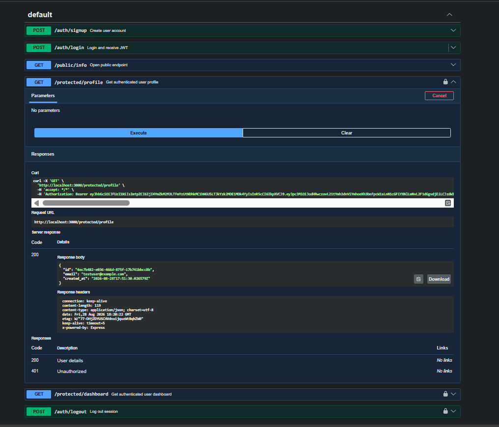

# FlyRank Auth & Route Protection API

A secure REST API built with Node.js, Express, and Supabase Auth as the Identity Provider.

## Overview
- **Identity Provider (IdP):** Delegates account creation, password management, and JWT signing to Supabase Auth.
- **JWT Middleware Guard:** Reusable Express middleware parses and validates JSON Web Tokens via Supabase before granting access to protected routes.
- **Interactive Swagger Documentation:** OpenAPI 3.0 specification with `bearerAuth` enabled on Swagger UI[cite: 1, 2].

## Environment Variables
Create a `.env` file in the root folder based on `.env.example`[cite: 1, 2]:
\`\`\`env
PORT=3000
SUPABASE_URL=https://your-project.supabase.co
SUPABASE_KEY=your_anon_key_here
\`\`\`

## How to Run

1. Clone repository:
   \`\`\`bash
   git clone https://github.com/Harshyy-e/CRUD-API-flyRank.git
   cd CRUD-API-flyRank
   \`\`\`
2. Install dependencies:
   \`\`\`bash
   npm install
   \`\`\`
3. Start the server:
   \`\`\`bash
   node server.js
   \`\`\`
4. Access interactive documentation:
   - Swagger UI: `http://localhost:3000/docs`[cite: 1, 2]

## Endpoints Reference

| Endpoint | HTTP Method | Auth Required | Status Codes | Description |
| :--- | :--- | :--- | :--- | :--- |
| `/auth/signup` | POST | None | 201, 400 | Create a new user account[cite: 1, 2] |
| `/auth/login` | POST | None | 200, 400, 401 | Authenticate and obtain JWT[cite: 1, 2] |
| `/public/info` | GET | None | 200 | Open public endpoint[cite: 1, 2] |
| `/protected/profile` | GET | `Authorization: Bearer <JWT>` | 200, 401 | Read current user's profile[cite: 1, 2] |
| `/protected/dashboard` | GET | `Authorization: Bearer <JWT>` | 200, 401 | Protected user dashboard[cite: 1, 2] |
| `/auth/logout` | POST | `Authorization: Bearer <JWT>` | 204, 401 | End user session[cite: 1, 2] |

## Swagger UI Bearer Auth

